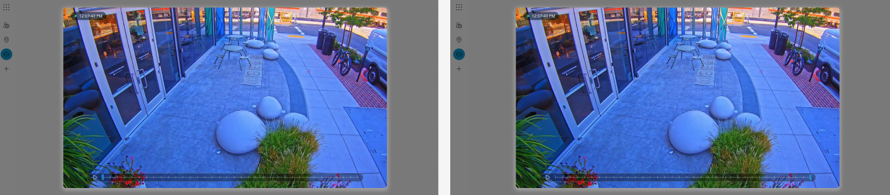

Prompt for chatgpt to reivew my code: 

initial code: /**
 * 
 * You are a seasoned hiring manager at a security device company, give me feedback on the 1 hour coding challenge over codesignal for a senior frontend engineering role.  I will paste in the the inital code that was given to me. I was instructed to build the video player timeline according to the mockup, which I will provide.  after that, I will paste in my version of the completed code. unfortunately I did not get to move forward. give me pointers how can I improve my interview / coding skills for the next interview. 
 * 

 * 
 */

/**
 * These configurations help control which thumbnails to fetch
 * for the timelapse viewer.
 * 
 * NOTE: Please do not edit this object unless instructed to by the interviewer.
 */
const API_CONFIG = {
  /**
   * The API path used to fetch the images
   */
  url: 'https://hiring.verkada.com/thumbs',

  /**
   * Start time of available timelapse images in milliseconds
   */
  startTimestamp: 1500348260,

  /**
   * End time of available timelapse images milliseconds
   */
  endTimestamp: 1503031520,

  /**
   * The frames per second used to capture the timelapse images
   */
  framesPerSecond: 50,

  /** The number of frames we want to fetch */
  frameCount: 30,

}

const PauseIcon = () => <svg width="8" height="14" fill="currentColor" xmlns="http://www.w3.org/2000/svg" stroke="currentColor"><path d="M1 0H0v14h1V0zM8 0H7v14h1V0z" stroke="none"/></svg>;

const PlayIcon = () => <svg width="18" height="16" viewBox="0 0 20 20" fill="currentColor" stroke="currentColor" xmlns="http://www.w3.org/2000/svg"><path d="M6 3l12 7-12 7V3zm0-1c-.17 0-.34.04-.5.13-.31.18-.5.51-.5.87v14c0 .36.19.69.5.87a.993.993 0 0 0 1-.01l12-7A1 1 0 0 0 19 10a1 1 0 0 0-.5-.86l-12-7C6.34 2.05 6.17 2 6 2z" stroke="none"/></svg>

// EDIT THE CODE BELOW

const getFrames = () => {
  const MS_PER_FRAME = (1 / API_CONFIG.framesPerSecond) * 1000;

  return new Array(API_CONFIG.frameCount).fill().map((_, index) => {
    const timestamp = API_CONFIG.startTimestamp + (index * MS_PER_FRAME);

    return {
      frameNumber: index,
      src: `${API_CONFIG.url}/${timestamp}.jpg`
    }
  });
}
 
const Frame = ({ frame }) => {
 
  return (
    

      

        

          Debug Information
          
Frame #: {frame.frameNumber}

        

        

          API Configuration
          <pre>{JSON.stringify(API_CONFIG, undefined, 2)}</pre>
        

      

      
       
    

  );
};

function App() {
  const [frames, setFrames] = React.useState(getFrames());
 
  return (
    

      <Frame frame={frames[1]} />
    

  );
}

ReactDOM.render(<App />, document.getElementById('app'));

style.scss: 
// SCSS Variables
$primary-color: #2ecc71;
$secondary-color: #3498db;
$danger-color: #e74c3c;
$warning-color: #f39c12;
$success-color: #27ae60;

// Neutral colors
$white: #ffffff;
$black: #000000;
$gray-100: #f8f9fa;
$gray-200: #e9ecef;
$gray-300: #dee2e6;
$gray-400: #ced4da;
$gray-500: #adb5bd;
$gray-600: #6c757d;
$gray-700: #495057;
$gray-800: #343a40;
$gray-900: #212529;

// Background colors
$bg-primary: #1a1a1a;
$bg-secondary: #2d2d2d;
$bg-light: #f8f9fa;
$bg-dark: #030e16;

// Text colors
$text-primary: $black;
$text-secondary: $gray-600;
$text-light: $white;
$text-muted: $gray-500;

// Border colors
$border-color: #eee;
$border-color-dark: #333;
$border-color-light: #b0b6be;

// Spacing
$spacing-xs: 4px;
$spacing-sm: 8px;
$spacing-md: 16px;
$spacing-lg: 24px;
$spacing-xl: 32px;
$spacing-xxl: 48px;

// Border radius
$border-radius-sm: 4px;
$border-radius-md: 6px;
$border-radius-lg: 8px;
$border-radius-xl: 10px;
$border-radius-xxl: 12px;

// Shadows
$shadow-sm: 0px 1px 3px rgba($black, 0.12);
$shadow-md: 0px 3px 8px -4px rgba($black, 0.8);
$shadow-lg: 0px 4px 20px rgba($black, 0.3);
$shadow-xl: 0px 10px 25px rgba($black, 0.15);

// Typography
$font-family-base: sans-serif;
$font-size-xs: 10px;
$font-size-sm: 12px;
$font-size-base: 14px;
$font-size-lg: 16px;
$font-size-xl: 18px;
$font-size-xxl: 20px;
$font-size-xxxl: 24px;

$font-weight-normal: 400;
$font-weight-medium: 500;
$font-weight-semibold: 600;
$font-weight-bold: 700;

// Transitions
$transition-fast: 0.1s ease;
$transition-base: 0.2s ease;
$transition-slow: 0.3s ease;

// Z-index
$z-index-dropdown: 1000;
$z-index-sticky: 1020;
$z-index-fixed: 1030;
$z-index-modal-backdrop: 1040;
$z-index-modal: 1050;
$z-index-popover: 1060;
$z-index-tooltip: 1070;

// Breakpoints
$breakpoint-sm: 576px;
$breakpoint-md: 768px;
$breakpoint-lg: 992px;
$breakpoint-xl: 1200px;
$breakpoint-xxl: 1400px;

// Mixins
@mixin flex-center {
  display: flex;
  align-items: center;
  justify-content: center;
}

@mixin flex-between {
  display: flex;
  align-items: center;
  justify-content: space-between;
}

@mixin button-reset {
  border: none;
  background: none;
  padding: 0;
  margin: 0;
  cursor: pointer;
}

@mixin card-style {
  background: $white;
  border-radius: $border-radius-md;
  box-shadow: $shadow-md;
  padding: $spacing-md;
}

@mixin responsive($breakpoint) {
  @if $breakpoint == sm {
    @media (min-width: $breakpoint-sm) { @content; }
  } @else if $breakpoint == md {
    @media (min-width: $breakpoint-md) { @content; }
  } @else if $breakpoint == lg {
    @media (min-width: $breakpoint-lg) { @content; }
  } @else if $breakpoint == xl {
    @media (min-width: $breakpoint-xl) { @content; }
  } @else if $breakpoint == xxl {
    @media (min-width: $breakpoint-xxl) { @content; }
  }
}

// CSS Custom Properties (for runtime changes)
* {
  box-sizing: border-box;
  
  --white: 255, 255, 255;
  --black: 0, 0, 0;
  --neutral: 200, 200, 200;
  --text-primary: var(--black);
  --text-secondary: var(--neutral);
  
  // Add SCSS variables as CSS custom properties
  --primary-color: #{$primary-color};
  --secondary-color: #{$secondary-color};
  --danger-color: #{$danger-color};
  --warning-color: #{$warning-color};
  --success-color: #{$success-color};
  --bg-primary: #{$bg-primary};
  --bg-secondary: #{$bg-secondary};
  --border-color: #{$border-color};
  --shadow-md: #{$shadow-md};
}

pre {
  margin: 0;
}

body {
  margin: $spacing-sm;
  font-family: $font-family-base;
  color: $text-primary;
  background-color: $bg-light;
}

.App {
  font-family: $font-family-base;
  text-align: center;
}

.frameWrapper {
  position: relative;
  border-radius: $border-radius-md;
  margin-bottom: $spacing-md;
  display: flex;
  flex-direction: column;
  align-items: center;
}

.frameImage {
  background-color: $bg-dark;
  width: 100%;
  height: 480px;
  border-radius: $border-radius-md;
  object-fit: cover;
  aspect-ratio: 640 / 480;
  box-shadow: $shadow-md;
}

.debug {
  margin-bottom: $spacing-lg;
  font-size: $font-size-sm;
  padding: $spacing-md;
  border: 1px solid $border-color-light;
  background-color: $white;
  border-radius: $border-radius-sm;
  text-align: left;
  box-shadow: $shadow-md;
  width: 100%;
}

.debugSection {
  font-weight: $font-weight-semibold;
  letter-spacing: 0.5px;
  display: flex;
  flex-flow: column;
  gap: $spacing-xs;
  margin-bottom: $spacing-lg;
  
  &:last-of-type {
    margin-bottom: 0;
  }
  
  > * {
    font-weight: $font-weight-normal;
  }
}
 

// Utility classes
.text-center { text-align: center; }
.text-left { text-align: left; }
.text-right { text-align: right; }

.mb-0 { margin-bottom: 0; }
.mb-1 { margin-bottom: $spacing-xs; }
.mb-2 { margin-bottom: $spacing-sm; }
.mb-3 { margin-bottom: $spacing-md; }
.mb-4 { margin-bottom: $spacing-lg; }
.mb-5 { margin-bottom: $spacing-xl; }

.p-0 { padding: 0; }
.p-1 { padding: $spacing-xs; }
.p-2 { padding: $spacing-sm; }
.p-3 { padding: $spacing-md; }
.p-4 { padding: $spacing-lg; }
.p-5 { padding: $spacing-xl; }

.d-flex { display: flex; }
.flex-center { @include flex-center; }
.flex-between { @include flex-between; }

.rounded { border-radius: $border-radius-md; }
.rounded-sm { border-radius: $border-radius-sm; }
.rounded-lg { border-radius: $border-radius-lg; }

.shadow { box-shadow: $shadow-md; }
.shadow-sm { box-shadow: $shadow-sm; }
.shadow-lg { box-shadow: $shadow-lg; }

my code: 
``import React from 'react';
import './App.css';
import './verkadaStyle.scss';
import 'bootstrap/dist/css/bootstrap.min.css';

/**
 * These configurations help control which thumbnails to fetch
 * for the timelapse viewer.
 * 
 * NOTE: Please do not edit this object unless instructed to by the interviewer.
 */
const API_CONFIG = {
    /**
     * The API path used to fetch the images
     */
    url: 'https://hiring.verkada.com/thumbs',

    /**
     * Start time of available timelapse images in milliseconds
     */
    startTimestamp: 1500348260,

    /**
     * End time of available timelapse images milliseconds
     */
    endTimestamp: 1503031520,

    /**
     * The frames per second used to capture the timelapse images
     */
    framesPerSecond: 50,

    /** The number of frames we want to fetch */
    frameCount: 30,

}

const PauseIcon = () => <svg width="8" height="14" fill="currentColor" xmlns="http://www.w3.org/2000/svg" stroke="currentColor"><path d="M1 0H0v14h1V0zM8 0H7v14h1V0z" stroke="none" /></svg>;

const PlayIcon = () => <svg width="18" height="16" viewBox="0 0 20 20" fill="currentColor" stroke="currentColor" xmlns="http://www.w3.org/2000/svg"><path d="M6 3l12 7-12 7V3zm0-1c-.17 0-.34.04-.5.13-.31.18-.5.51-.5.87v14c0 .36.19.69.5.87a.993.993 0 0 0 1-.01l12-7A1 1 0 0 0 19 10a1 1 0 0 0-.5-.86l-12-7C6.34 2.05 6.17 2 6 2z" stroke="none" /></svg>

// EDIT THE CODE BELOW

const getFrames = () => {
    const MS_PER_FRAME = (1 / API_CONFIG.framesPerSecond) * 1000;

    return new Array(API_CONFIG.frameCount).fill().map((_, index) => {
        const timestamp = API_CONFIG.startTimestamp + (index * MS_PER_FRAME);

        return {
            frameNumber: index,
            src: `${API_CONFIG.url}/${timestamp}.jpg`
        }
    });
}

const createMarkers = (frames, currentFrame, onMarkerClick) => {
    return frames.map((frame, idx) => (
        
 onMarkerClick(idx)}
        >
            |
        

    ));
}

const Frame = ({ frame, currentFrame, onMarkerClick }) => {
    const [play, setPlay] = React.useState(false);
    const frames = getFrames();

    return (
        

            

                

                    Debug Information
                    
Frame #: {frame.frameNumber}

                    
Current Frame: {currentFrame + 1}

                

                

                    API Configuration
                    <pre>{JSON.stringify(API_CONFIG, undefined, 2)}</pre>
                

            

            
            

                
 setPlay(prev => !prev)}>
                    {play ? <PlayIcon /> : <PauseIcon />}
                

                

                    {createMarkers(frames, currentFrame, onMarkerClick)}
                

            

        

    );
};

function VerkadaPlayer() {
    const [frames] = React.useState(getFrames());
    const [currentFrame, setCurrentFrame] = React.useState(0);

    const handleMarkerClick = (idx) => {
        setCurrentFrame(idx);
    };

    return (
        

            <Frame
                frame={frames[currentFrame]}
                currentFrame={currentFrame}
                onMarkerClick={handleMarkerClick}
            />
        

    );
}

export default VerkadaPlayer;

insert screenshot of mockup: 
 

  

