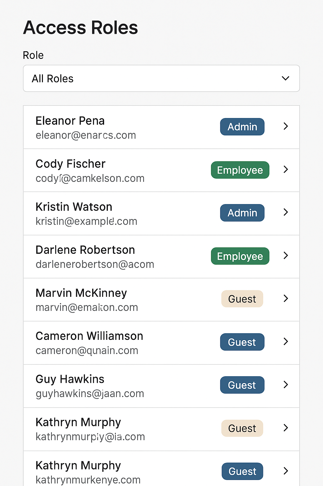

🔐 Practice Prompt: “Access Roles Management Panel”

Objective:
Using React and TypeScript, build a responsive Access Roles Management Panel based on the provided Figma design. It should support:

Displaying a list of users and their current access roles (e.g., Admin, Employee, Guest)
Ability to filter by role
A role badge UI with color-coded styles
Modal to edit a user’s role
Accessible interactions and keyboard support
📦 Requirements:
React + TypeScript (no external UI libraries unless otherwise stated)
Use modular, reusable components
Responsive layout (mobile & desktop)
Accessible: keyboard navigation, semantic HTML, ARIA labels
Match the Figma design closely
Role update should be optimistic (simulate async)
🧩 Features to Implement:
✅ User List Panel
Shows name, email, current role badge
Click on row opens edit modal
🔍 Filter Dropdown
Options: All Roles, Admin, Employee, Guest
🏷️ Role Badges
Visual distinction with color
Use consistent styling system (CSS modules or CSS-in-JS)
🧮 Edit Modal
Change role with dropdown
"Save" triggers fake API delay
"Cancel" closes modal
♿️ Accessibility
Tab flow and ARIA roles
Focus trap in modal
📁 Suggested File Structure:
/components
  /UserCard.tsx
  /RoleBadge.tsx
  /EditRoleModal.tsx
  /FilterBar.tsx
/pages
  /AccessRoles.tsx
/styles
  /access-roles.css (or .module.css)

  