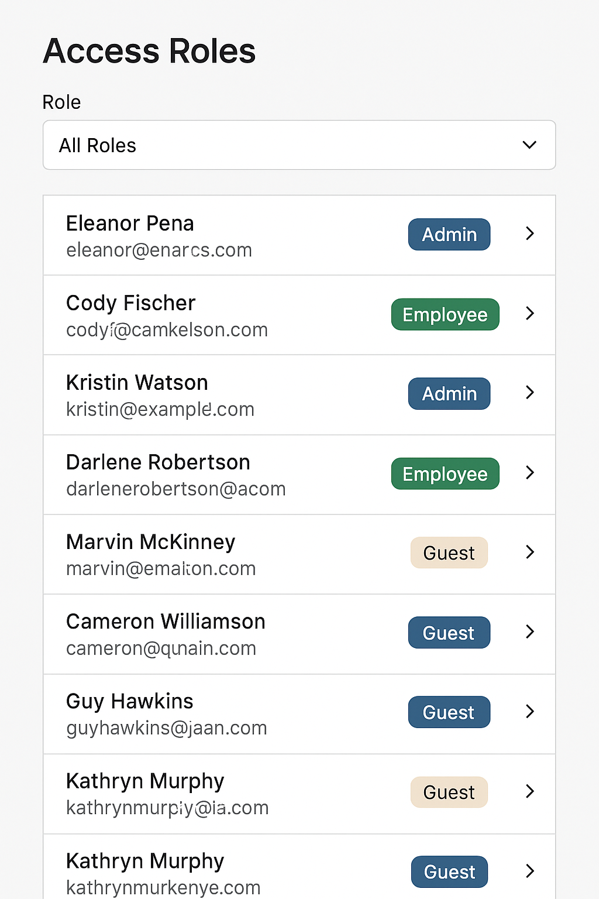

# 🕒 1-Hour React Practice Challenge: Access Role Manager

## 🎯 Goal

Build a simple **User Access Role Manager** that allows you to:

- View a list of users.
- Assign them a role from a dropdown (`Admin`, `Employee`, `Visitor`).
- Save changes to a central state.

---

## 🖼 UI Layout

```
+-----------------------------------------+
| User Access Role Manager                |
+-----------------------------------------+
| Name       | Role (dropdown)  |        |
|------------|------------------|--------|
| Alice      | [ Admin ▼ ]      |        |
| Bob        | [ Visitor ▼ ]    |        |
| Carol      | [ Employee ▼ ]   |        |
+-----------------------------------------+
| [ Save All Changes ]                    |
+-----------------------------------------+
```

### Sample Mockup 


---

## 🧱 Requirements

### 1. `UserRoleRow` Component
- Receives `name`, `currentRole`, and `onRoleChange`.
- Renders user name and a dropdown with 3 options.
- Uses controlled input (`<select>`).

### 2. `UserRoleTable` Component
- Maps over a list of users.
- Renders a `UserRoleRow` for each.

### 3. `AccessRoleManager` (App)
- Holds the main state.
- Tracks role changes.
- Clicking **Save** logs updated state to console.

---

## 📋 Initial Data

```js
const USERS = [
  { id: 1, name: "Alice", role: "Admin" },
  { id: 2, name: "Bob", role: "Visitor" },
  { id: 3, name: "Carol", role: "Employee" },
];
```

---

## 🧠 What You’re Being Tested On

| Concept                    | Description |
|---------------------------|-------------|
| 🔁 Controlled Components   | Handling dropdown/select properly |
| 🎣 State Lifting           | Managing role state in parent |
| 📤 Props & Events          | Passing updates up via `onChange` |
| 🧩 Reusability             | Keeping `UserRoleRow` clean and reusable |
| 🧠 State Merging Logic     | Updating user role state correctly without mutation |

---

## ⏰ Suggested Time Breakdown

- 10 min — Layout & planning
- 35 min — Build components and data flow
- 15 min — Polish, test, and optional extras

---

## ✨ Bonus Features (Optional)
- Add a “dirty” indicator for unsaved rows.
- Disable the Save button unless changes exist.
- Show a confirmation toast after save.
- Add filter/search by name.
